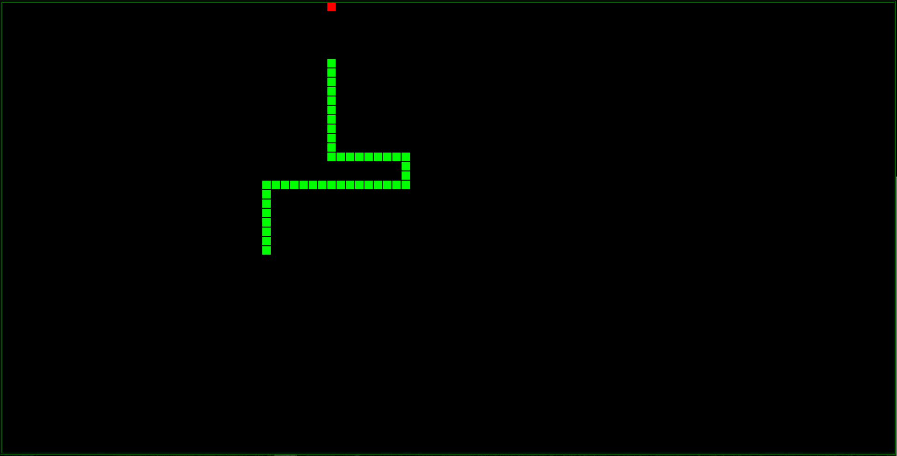

# Classic Snake Game

An old school style snake game all in one html file for extremely fast setup and usage.

Instantly run in any browser window. It runs using only HTML, CSS, and plain Javascript from canvas element. 

## Controls

* Arrow Keys &#x2190;&#x2195;&#x2192; = Change Direction / Start Moving
* ENTER = Restart on Game Over
* PAUSE = Pause in Gameplay / Restart on Game Over
* *Resize Window* = Change Game Board Size and Shape

## Version

Currently on version 2.0 with basic retro snake functionality.

Version 2.1 and later will be updating the game with more interesting functionality that will result in less retro style gameplay but will make the game more immersive and engaging.

## Author

-**Mike** at **Titan Global Tech, LLC** - *All included work* - [b1tn3r](https://github.com/b1tn3r)

## License

This project is licensed under the MIT License - see the [LICENSE.md](LICENSE.md) file for details.